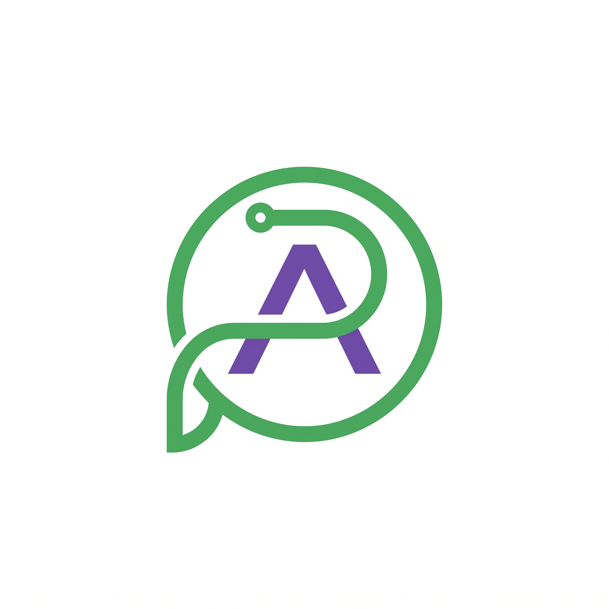

# AMAPE Tecnologia

<h3 align="center">
Tecnologia inteligente para empresas que querem evoluir.
</h3>

Suporte técnico, desenvolvimento de sistemas, manutenção e soluções digitais personalizadas.

---

## Sobre a AMAPE

A AMAPE Tecnologia nasceu com o objetivo de transformar a tecnologia em uma ferramenta estratégica para empresas.

Criamos soluções digitais unindo:

- Suporte técnico
- Desenvolvimento de sistemas
- Criação de sites
- Automação de processos
- Organização de ambientes tecnológicos

Nosso propósito é aproximar empresas da tecnologia através de soluções eficientes, personalizadas e estratégicas.

---

## Serviços

<table>
<tr>

<td width="50%">

### Suporte Técnico

Manutenção de computadores, configuração de equipamentos, atendimento remoto e presencial.

</td>

<td width="50%">

### Desenvolvimento

Criação de sites, sistemas personalizados e aplicações web.

</td>

</tr>

<tr>

<td width="50%">

### Tecnologia

Melhoria de processos, organização de ambientes e soluções digitais.

</td>

<td width="50%">

### Segurança

Boas práticas, proteção de informações e melhoria da infraestrutura.

</td>

</tr>

</table>

---

# Projetos Desenvolvidos

## Toca dos Tatus

Plataforma digital desenvolvida para adoção e divulgação de animais.

Tecnologias utilizadas:

Acesse:

https://sitetocadostatus.vercel.app/

---

## Peixaria & Empório do Vale

Desenvolvimento de presença digital e solução web para negócio local.

Tecnologias utilizadas:

Acesse:

https://peixariaeemporiodovale.vercel.app/

---

# Identidade Visual

Cores utilizadas na marca:

| Cor | Hex |
|---|---|
| Verde escuro | #052E16 |
| Verde principal | #166534 |
| Verde claro | #22C55E |
| Roxo | #8B5CF6 |
| Roxo escuro | #6D28D9 |

---

# Tecnologias

---

# Materiais Comerciais

📑 Apresentação Institucional
📘 Catálogo Comercial

Os materiais encontram-se disponíveis na pasta assets.

# Contato

Site:

https://portfolio-amanda-lime.vercel.app/

Instagram:

https://instagram.com/amape.tecnologia

LinkedIn:

https://linkedin.com/company/amape-tecnologia

E-mail:

amape.tecnologia@gmail.com

---

AMAPE Tecnologia

Soluções digitais, suporte e inovação para empresas.

